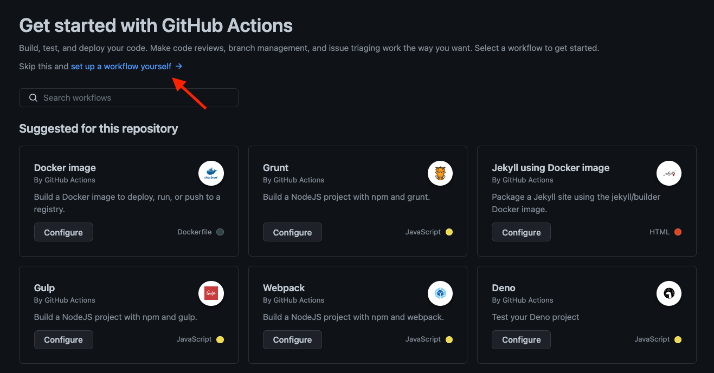
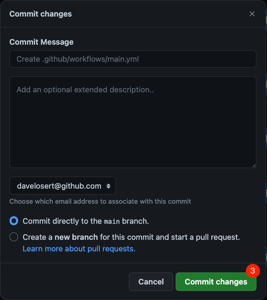

# Part 1 - Hello World

GitHub Actions is a continuous integration and continuous deployment (CI/CD) platform that allows you to automate your build, test, and deployment pipelines. It gives you the ability to create workflows that build and test every pull request to your repository, and then later automatically deploy merged pull requests to production.

GitHub Actions also supercharges DevOps by allowing you to run workflows triggered by a large number of different events in your repository. As an example, you can build a workflow which automatically adds the appropriate labels (e.g. "bug" or "triage") whenever someone creates a new issue in your repository.

GitHub provides Linux, Windows, and macOS virtual machines to run your workflows, or you can host your own self-hosted runners in your own data center or cloud infrastructure.

**The components of GitHub Actions**

GitHub Actions workflows are always triggered by events occurring in your repository such as a pull request being opened or an issue being created. A workflow contains one or more jobs which can run in sequential order or in parallel. Each job will run inside its own virtual machine runner, or inside a container, and has one or more steps. Each step executes either a shell script or an action, which is a reusable extension that automates a certain piece of your workflow.


You can read more about [GitHub Actions and workflows components](https://docs.github.com/en/actions/learn-github-actions/understanding-github-actions#the-components-of-github-actions) in the official documentation.

## 1 - Implement your first workflow with GitHub Actions

### 1.1 - Create a "Hello World" workflow

Enough talking. Let's create our very first GitHub Actions workflow!

1. In your repository, click on the **Actions** tab. You will be offered a list of workflow suggestions. For your first workflow, however, you need to click the **set up a workflow yourself** link at the top of the page.

  

2. This will automatically bring you to the GitHub Web GUI Action Editor, which prompts you to create a new file in your repository under `.github/workflows/main.yml`. Paste the following content into it:

    ```yml
    name: Hello World Training Workflow

    on:
      workflow_dispatch:

    jobs:
      greet:
        runs-on: ubuntu-latest
        steps:
          - name: Greet the User
            run: echo "Hello World!"
    ```

    

3. Click on `Commit changes` and then commit it directly to the `main` branch (we won't tell anyone 🤫).

    

Rename the file to `hello.yml`, click **Start Commit** and commit it directly to the `main` branch.

### 1.2 - Run the workflow manually

The workflow you created is triggered by the `workflow_dispatch` event, meaning it can be manually executed:

```yml
on:
  ...
  # Allows you to run this workflow manually from the Actions tab
  workflow_dispatch:
```
You can manually execute your workflow by navigating to the **Actions** tab, selecting your desired workflow, and clicking on the **Run workflow** button:


Refresh the page or wait a few seconds to see the results of your workflow run.


Congratulations, you have just run your first GitHub Actions workflow. 🥳

> **About workflow triggers**
>
> Your workflows are only triggered by the events you specify. For more information, see "[Configuring a workflow](https://docs.github.com/en/actions/using-workflows)" and "[Workflow syntax for GitHub Actions](https://docs.github.com/en/actions/using-workflows/workflow-syntax-for-github-actions)". We will learn more about this shortly.

## 1.3 - Analyze your workflow

In the list of workflow runs, click on one of the runs for the "Hello World" workflow. You will be shown its single job (`greet`) under "Jobs" on the left side of the page. Click on that job to view its logs (you can expand the logs for a particular step by clicking on it).

The workflow run view also allows you to re-run jobs in case problems occurred (button on the top right). Additionally, re-running a job allows you to enable [debug logging](https://docs.github.com/en/actions/monitoring-and-troubleshooting-workflows/enabling-debug-logging).

## 2 - Use an action

Using bash commands to automate processes is a fundamental requirement for any CI/CD system. However, writing shell scripts can become very cumbersome as you scale, and you might find yourself rewriting the same functionality across different projects.

Fortunately, GitHub Actions offers a much better way to handle automation: by using **actions**! An **action** is a small, composable, and reusable unit of automation code that can be easily integrated into all of your workflows.

### 2.1 - Add an action to your workflow

Let's start by using one of the most basic yet commonly used actions to gain an understanding: The `actions/checkout` action:

1. In your editor, navigate to the `Code` tab, then to `.github/workflows/hello.yml`, and then click the little pencil icon in the top right corner to reopen the actions editor.
2. Add the following steps to the existing job:

    ```yml
    steps:
      - name: Greet the User
        run: echo "Hello World!"
      # List all files in the current directory for comparison before and after actions/checkout@v3.
      - run: ls -l
      - uses: actions/checkout@v3
      - run: ls -l
    ```

    Note that, unlike running shell commands, running an action requires the use of the `uses` keyword.

3. Commit the changes and trigger a new workflow run.

### 2.2 - Understand the power of Actions

If you examine the workflow logs and compare the output of the two `ls -l` commands, you will notice that the `actions/checkout` Action has checked out the `main` branch of our repository onto the runner. And it accomplished this without requiring you to specify any `git clone` shell command or any references or configurations.

This is just the tip of the iceberg. There are thousands of even more sophisticated actions available for you to use, which can turn complex automations into a matter of a few lines of configuration. We will explore many of these throughout this workshop.

If you’re eager to explore all the existing Actions created not only by GitHub but by the entire open-source community, head over to the [GitHub Marketplace](https://github.com/marketplace?category=&query=&type=actions&verification=).

## 3 - Use Environment variables and context

You can use environment variables to add information that you would like to reference in your workflows. Some environment variables are even predefined for you to use immediately (e.g., the person who triggered the current workflow run). To make use of these, edit the "Hello World" workflow and add the following lines:

1. Add an environment variable at the job level:

    ```yml
        greet:
            env:
                MY_ENV: "John Doe"
    ```

2. Add a second step to utilize your environment variable and a default one:

    ```yml
          - name: Run a multi-line script
            run: |
              echo "Hello $MY_ENV"
              echo "Hello $GITHUB_ACTOR"
    ```

<details>
<summary>Your workflow file (main.yml) should now look like this:</summary>

```yml
name: Hello World Training Workflow

on:
  workflow_dispatch:

jobs:
  greet:
    env:
      MY_ENV: "John Doe"
    runs-on: ubuntu-latest
    steps:
      - name: Greet the User
        run: echo "Hello World!"
      - name: Run a multi-line script
        run: |
          echo "Hello $MY_ENV"
          echo "Hello $GITHUB_ACTOR"
```

</details>

Commit your changes and start a new run. You should see the following in the run logs (note that the second `Hello` should print your own GitHub username):


To learn more about environment variables and default variables, see [the official GitHub documentation on Environment variables](https://docs.github.com/en/actions/learn-github-actions/environment-variables).

## 4 - Make additional events trigger your workflow

GitHub Actions workflows can be triggered by many different types of events:

- [Events that trigger workflows](https://docs.github.com/en/actions/using-workflows/events-that-trigger-workflows)

Let's modify our workflow so that it also runs automatically whenever an issue is created in our repository. This practice is commonly referred to as "IssueOps". To achieve this, add the following to the `on` section of the workflow file and commit the changes:

```yml
...

on:
  workflow_dispatch:
  issues:
    types: [opened, edited]

...
```

Now create an issue in your repository and check the Actions tab. You should see the workflow run as follows:


## Conclusion

In this first part of the Actions workshop, you have learned how to:

- 👏 Create a new Actions workflow for automation.
- 👏 Analyze your workflow runs and gain insights into what happened.
- 👏 Use your first reusable Action.
- 👏 Run automation on different events, including manual triggers and issues.

Now let's use GitHub Actions to create a CI/CD workflow for our application.

---

Next:

- **[Basics of Continuous Integration with Actions](002-basics-of-ci-with-actions.md)**
